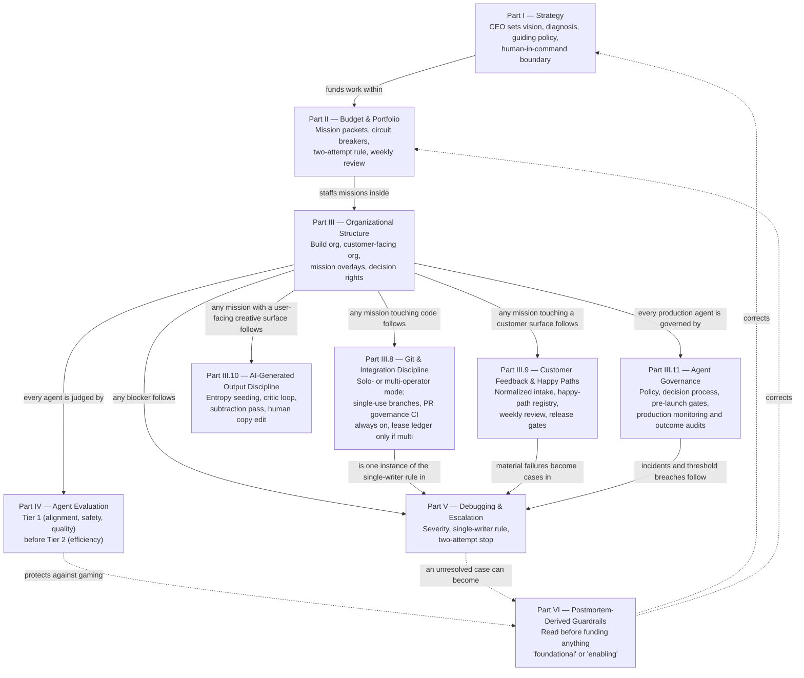

# Agentic Organization Framework

A product-agnostic operating system for a human principal (a "CEO") directing a team of AI agents from strategy through budget through build — plus the concrete git-integration discipline needed once more than one agent can write code, and an optional customer-feedback/happy-path discipline for products with direct end users.

This repo is a **GitHub template**. Use it to scaffold the coordination layer of a new project; don't fork it as a dependency.

## Quick start

Point any capable agent — Claude, GPT, Gemini, whatever you're already using — at this repo and say:

> Read `SETUP.md` and walk me through setting up the Agentic Organization Framework for my project.

`SETUP.md` is written as a self-contained playbook for the *agent*, not for you: it interviews you section by section (strategy, leadership, org shape, budget defaults, git/lease setup), pushes back on thin answers, and writes the completed documents into your project as it goes. It works whether the agent has file access to your repo or is just a plain chat window — see `SETUP.md`'s top section for both paths. No Claude-specific tooling required; `AGENTS.md` and `CLAUDE.md` in this repo are just one-line pointers at `SETUP.md` for agents that auto-load a convention file.

Prefer to do it by hand instead? See "Manual setup" below.

### Mechanical installation

The interview produces the decisions; `.agentic-org.json` makes those decisions executable. Copy `.agentic-org.example.json`, choose a `lightweight`, `solo`, or `multi` profile, set repository and leadership values, and select optional modules. Then run:

```bash
python3 scripts/scaffold_framework.py --target .          # dry run
python3 scripts/scaffold_framework.py --target . --apply  # write reviewed changes
python3 scripts/framework_doctor.py --repo .              # local consistency
python3 scripts/framework_doctor.py --repo . --github     # include branch protection
```

The scaffold owns only files listed in `.agentic-org.generated.json`. Re-running it is idempotent; it updates files that still match their prior generated hash and stops before overwriting local edits. Configuration drives branch names, remote, profile, lease ledger, risk paths, and optional modules across the scripts and workflows.

For a brownfield repository, keep an existing authoritative file human-owned
with `--preserve-existing PATH` after reviewing it against the generated
equivalent. Repeat the flag for each conflict. Preserved files are recorded in
the generated-state manifest and doctor reports them as manual controls; the
scaffold never overwrites or claims ownership of them.

`lightweight` uses the short mission packet and may omit secondary leadership,
path-list, and disabled-module fields; safe defaults fill them. `solo` installs
the full mission and organizational communication packet for one operator.
`multi` adds the live lease ledger and concurrent-writer controls. Every profile
retains candidate-bound review, Git governance, the control matrix, and the
Agent Governance Charter required for consequential or production use.

## How the parts fit together



Solid arrows are the normal top-down flow of authority and work; dashed arrows are the feedback loop — Part VI exists because Parts I–V, followed correctly but without a "stop and check" mechanism, still produced an overrun in practice. Part VII in `FRAMEWORK.md` (Adoption Guide) walks the same path as a day-0 checklist.

Part III.8 itself forks once at onboarding: **solo-operator** (one human directing agent sessions, nobody else who could hold write access) drops the Merge Steward/lease-ledger ceremony; **multi-operator** keeps it. The PR-governance CI checks (ancestry, single-use branches, changed-file manifest, high-risk classification) are not part of that fork — they run unconditionally in both modes. See §III.8 and `templates/GIT_OPERATIONS_COVENANT.md`'s "Solo-operator mode" section.

## What's in here

| Path | What it's for |
|---|---|
| `FRAMEWORK.md` | The framework itself: strategy, budget/circuit-breakers, org structure, git discipline, agent governance, evaluation, debugging/escalation, postmortem-derived guardrails, and condensed appendix templates. Read this first. |
| `SETUP.md` | Agent-agnostic interview playbook — the fastest way to adopt this framework. See Quick start above. |
| `.agentic-org.example.json` | Versioned example for the shared project configuration. Copy it to `.agentic-org.json`; `multi` requires a numeric GitHub ledger issue URL, while `solo` and `lightweight` require `null`. |
| `scripts/scaffold_framework.py` | Dry-run-by-default, idempotent installer for configured docs, scripts, and workflows. It records generated-file hashes and refuses to overwrite human edits. |
| `scripts/framework_doctor.py` | Checks configuration, required artifacts, unresolved placeholders, module/profile consistency, and generated-file drift. `--github` also checks required branch-protection status contexts. |
| `templates/control-matrix.json` / generated `docs/CONTROL_MATRIX.md` | Versioned control inventory and profile/module-specific rendered matrix showing risk, owner, evidence, failure behavior, and enforcement status. Doctor checks applicable rows. |
| `templates/MISSION_PACKET_TEMPLATE.md` | Full mission packet to copy for every new assignment (condensed version is in `FRAMEWORK.md` Appendix D). |
| `templates/LIGHTWEIGHT_MISSION_TEMPLATE.md` | Short packet for bounded single-operator work: outcome, authority, limits, evidence, risk gates, and stop/handoff. The full packet remains available when coordination grows. |
| `templates/GIT_OPERATIONS_COVENANT.md` | The full git governance contract referenced by `FRAMEWORK.md` §III.8 — merge authority, worktree leases, single-use branches, PR metadata contract, the "Solo-operator mode" section for single-operator repos, and "Keeping the Changed-file manifest from going stale" covering the `--body-file` preflight and the two optional manifest-sync automations below. |
| `templates/GIT_WORK_REGISTRY.md` | Blank audit-snapshot registry that mirrors your live lease ledger (a pinned GitHub issue — see below). Multi-operator mode only; a solo-operator repo has no ledger to snapshot. |
| `templates/SHAREABLE_AGENT_ORG_AND_COMMUNICATION_BUS.md` | Generic org/communication-bus diagrams referenced by `FRAMEWORK.md` §III.6. |
| `.github/pull_request_template.md` | PR body with the required sections the governance check parses (`## Outcome`, `## Git-work lease`, `## Changed-file manifest`, etc.), with inline notes on what changes in solo-operator mode. |
| `.github/workflows/git-governance.yml` | CI check that fails a PR closed when governance metadata is missing, stale, or inconsistent. Cancels superseded runs for the same PR and reads live PR body/head together at execution time (not the triggering event's snapshot) to avoid a race on rapid pushes/edits. Concurrency is SHA-scoped so a manifest-sync rerun (below) can't cancel a legitimate in-progress run for a newer commit. |
| `scripts/create_feature_worktree.py` | Creates a single-use feature branch/worktree directly from a freshly-fetched exact base SHA; fails if that SHA is no longer the remote tip. |
| `scripts/check_pr_readiness.py` | Pre-flight check to run before opening/updating a **feature** PR (strict ancestry model — do not use for releases). `--body-file <path> [--solo-mode]` validates a drafted PR body locally the exact way CI will — required headings, every Changed-file manifest line individually checked, declared manifest vs. the real diff — catching malformed-but-plausible-looking manifest lines before they become a confusing CI failure. |
| `scripts/check_git_governance.py` | The policy engine `git-governance.yml` runs in CI; also runnable locally. It validates exact manifests, authorized path scope, meaningful required sections, and structured candidate-bound review records. High-risk records require independent approval; evidence truth remains a human decision. |
| `scripts/create_release_pr.py` | Atomically creates or repairs the configured integration-to-release PR. New releases require explicit scope reference/path, reviewer, evidence reference, decision timestamp, and test evidence arguments; the reviewed head is bound automatically. `--sync-mechanical` updates only mechanical sections and dispatches or identifies exact-head governance validation. Never merges. |
| `scripts/sync_pr_manifest.py` | Optional automation: recomputes only a feature PR's manifest against exact refs, aborts or retries on body/head races, preserves every human section, and dispatches or identifies trusted governance validation for the resulting exact head. |
| `templates/github-workflows/` | Optional manifest-sync workflows. The scaffold renders configured branch names and installs them under `.github/workflows/` only when `modules.manifest_sync` is enabled. |
| `templates/customer-feedback/` | Optional §III.9 add-on for products with direct end users: normalized feedback intake, happy-path registry, weekly-review templates, and the Build-agent instructions that wire them into every customer-facing change. See that directory's own README. |
| `templates/AI_OUTPUT_DISCIPLINE_TEMPLATE.md` | Optional §III.10 add-on for any mission with a user-facing creative surface (UI, visual design, product copy): rationale, entropy-seeding/critic-loop prompt skeletons, and a delivery checklist (subtraction pass, project-specific AI-tells list, human copy edit). |
| `templates/AGENT_GOVERNANCE_TEMPLATE.md` | Mandatory §III.11 charter for any production agent: acceptable and prohibited use, prohibited data, risk-tiered human review, Governance Board and escalation, pre-launch/red-team gates, drift and incident monitoring, and independent outcome audits. |
| `scripts/customer_feedback_harness.py` | Strict feedback normalization and deterministic as-of weekly-review rendering behind §III.9. It isolates malformed rows, applies privacy intake guardrails to decoded metadata, and surfaces conflicting record identities. Product-agnostic; extend via `pseudonym_namespace` and `extra_forbidden_fragments` rather than forking it. |
| `scripts/build_weekly_feedback_review.py` | CLI that renders a weekly review Markdown file from one or more JSONL feedback exports. |
| `scripts/conformance/` | Product-neutral adapter protocol, restartable reference adapter, and executable fixtures for budgets, attempts, approvals, persistence, and revocation. This is a contract test kit, not a production runtime. |
| `.github/workflows/template-quality.yml` | Source-template CI: unit/conformance tests, Python compilation, workflow/link checks, and a lightweight/solo/multi × default/custom branch scaffold-and-doctor matrix. |
| `pyproject.toml` | Python/test metadata for the framework harness; install the `test` extra to run the checked-in pytest suite. |

## Manual setup

If you'd rather not run the interview, `SETUP.md`'s sections map directly onto these steps — do them yourself in the same order:

1. Click **Use this template** → **Create a new repository** (or copy these files into an existing repo).
2. Fill in Part I's Strategy Constitution (`FRAMEWORK.md` §I.3) and save it as `docs/strategy/STRATEGY.md`. Name your two leadership roles (§III.2) and adapt the value-stream stages in §III.4 to your product.
3. Copy `.agentic-org.example.json` to `.agentic-org.json`. Choose `lightweight`, `solo`, or `multi`; enter the real product, repository, remote, and branch names. Solo and multi require the complete leadership, path-policy, and module fields; lightweight may use the reduced defaults described above.
4. **Multi-operator only:** create and pin the Git-work Lease Ledger issue described in `SETUP.md` §5, then put its full numeric issue URL in `git_governance.ledger_url`. `solo` and `lightweight` use `null`.
5. Run `python3 scripts/scaffold_framework.py --target .`, review the dry run, then rerun with `--apply`. This renders names and branches, installs the profile-appropriate documents, and enables only selected modules.
6. Review the concise generated `AGENTS.md`, which links the configuration, control matrix, startup instructions, and profile-appropriate mission packet. A pre-existing customized `AGENTS.md` produces a scaffold conflict instead of being overwritten.
7. Complete and approve the generated Agent Governance Charter before production use. Fill every policy, decision-right, pre-launch gate, monitoring, incident, and outcome-audit field.
8. Run `python3 scripts/framework_doctor.py --repo .`; after configuring GitHub branch protection, run it again with `--github`.
9. Run Part VII's Day-0 checklist in `FRAMEWORK.md`.

**Note on the release path:** `main` normally diverges from a persistent `staging` branch after every GitHub release merge (the release merge commit only exists on `main`), so a naive "base must be an ancestor of head" ancestry check will fail on the *second* release PR, not the first — this is the failure mode `scripts/check_git_governance.py` and `scripts/create_release_pr.py` are built to avoid. If you're adopting this checker on a repo where `main`/`staging` have already diverged by more than one prior release, you'll need the one-time bootstrap noted in `templates/GIT_OPERATIONS_COVENANT.md`'s release contract before the first governed release PR can pass.

## Why this exists

Extracted and generalized from RoleWise's operating model after two documented incidents: an over-scoped "foundational" platform mission that grew to ~4,580 lines chasing a proof nobody had asked for, and unowned git worktrees/stacked branches producing silent drift once multiple agents could write code. `FRAMEWORK.md` Part VI (Postmortem-Derived Guardrails) is the literal list of corrections; read it before funding anything described as "foundational" or "enabling."

## When this doesn't fit

RoleWise itself later removed the full framework — the CSO/CEO org-simulation layer (`CORE_ORG.md`, `AGENT_OPERATING_CHARTER.md`, `ACTIVE_TEAM.md`, mission packets, the evaluation covenant) — after adopting it. Reasons, for anyone deciding whether to adopt this template as-is:

- **It was sized for a problem RoleWise didn't have.** The framework's git discipline and mission-coordination ceremony assume multiple independent agents/operators who need role separation and a shared ledger to avoid stepping on each other. RoleWise is one human operator directing Claude Code/Codex sessions directly — there was no second decision-maker for the CEO/CSO split, or a second lease-holder for the worktree ledger, to actually coordinate with.
- **The ceremony didn't prevent the failure mode it targeted.** Merge conflicts still happened — several parallel feature branches all touching the same files (a UI component and its tests) without merging the base branch back in regularly. `ACTIVE_TEAM.md` faithfully recorded that all this work was in flight, but nothing in the framework forced any of those branches to reconcile with the base branch before diverging further. The actual fix was a plain git habit (merge the base branch in early and often) plus a lightweight CI comment showing how many commits a PR is behind — not org roleplay.
- **The overhead was measurable and one-sided.** Standing the framework up took 4+ PRs; removing it cleanly took 3 follow-up commits. That cost was paid without a matching case where the ceremony caught a problem the underlying git/CI mechanics wouldn't have caught on their own.

None of this means the framework is wrong for its intended case — a real team with multiple people or agents needing role separation, budget/circuit-breaker discipline, and a shared coordination ledger. It means: before adopting the full org-simulation layer, check whether you actually have more than one decision-maker to coordinate. If not, the git-integration discipline (Part III.8) and postmortem guardrails (Part VI) may be worth keeping on their own, without Parts I–III's strategy/org/mission-packet ceremony on top.

**Update:** Part III.8 itself now applies this same test internally. Its Merge Steward role and worktree-lease ledger have the exact "nobody to coordinate with" problem described above when there's truly one operator — so III.8 now has a solo-operator mode that drops that ceremony while keeping the CI-enforced git-hygiene checks (the part that actually caught real drift) mandatory in both modes. See §III.8 and `templates/GIT_OPERATIONS_COVENANT.md`'s "Solo-operator mode" section.

Update this template as you learn — the whole point is that the next project starts with the last project's scar tissue built in, not re-derives it from scratch.
