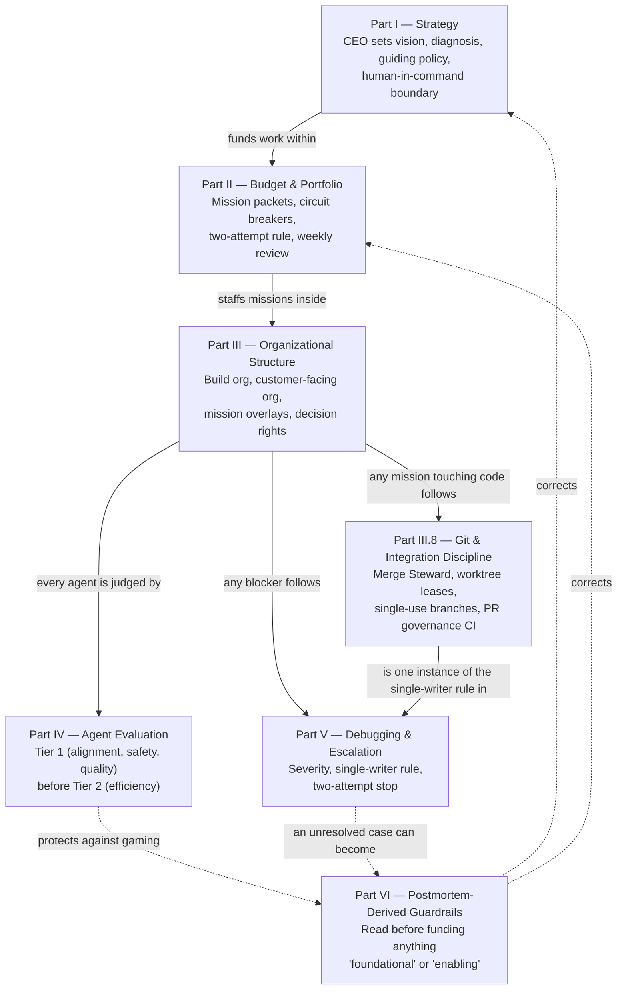

# Agentic Organization Framework

A product-agnostic operating system for a human principal (a "CEO") directing a team of AI agents from strategy through budget through build — plus the concrete git-integration discipline needed once more than one agent can write code.

This repo is a **GitHub template**. Use it to scaffold the coordination layer of a new project; don't fork it as a dependency.

## Quick start

Point any capable agent — Claude, GPT, Gemini, whatever you're already using — at this repo and say:

> Read `SETUP.md` and walk me through setting up the Agentic Organization Framework for my project.

`SETUP.md` is written as a self-contained playbook for the *agent*, not for you: it interviews you section by section (strategy, leadership, org shape, budget defaults, git/lease setup), pushes back on thin answers, and writes the completed documents into your project as it goes. It works whether the agent has file access to your repo or is just a plain chat window — see `SETUP.md`'s top section for both paths. No Claude-specific tooling required; `AGENTS.md` and `CLAUDE.md` in this repo are just one-line pointers at `SETUP.md` for agents that auto-load a convention file.

Prefer to do it by hand instead? See "Manual setup" below.

## How the parts fit together

Solid arrows are the normal top-down flow of authority and work; dashed arrows are the feedback loop — Part VI exists because Parts I–V, followed correctly but without a "stop and check" mechanism, still produced an overrun in practice. Part VII in `FRAMEWORK.md` (Adoption Guide) walks the same path as a day-0 checklist.

## What's in here

| Path | What it's for |
|---|---|
| `FRAMEWORK.md` | The framework itself: strategy, budget/circuit-breakers, org structure, git discipline, agent evaluation, debugging/escalation, postmortem-derived guardrails, and condensed appendix templates. Read this first. |
| `SETUP.md` | Agent-agnostic interview playbook — the fastest way to adopt this framework. See Quick start above. |
| `templates/MISSION_PACKET_TEMPLATE.md` | Full mission packet to copy for every new assignment (condensed version is in `FRAMEWORK.md` Appendix D). |
| `templates/GIT_OPERATIONS_COVENANT.md` | The full git governance contract referenced by `FRAMEWORK.md` §III.8 — merge authority, worktree leases, single-use branches, PR metadata contract. |
| `templates/GIT_WORK_REGISTRY.md` | Blank audit-snapshot registry that mirrors your live lease ledger (a pinned GitHub issue — see below). |
| `templates/SHAREABLE_AGENT_ORG_AND_COMMUNICATION_BUS.md` | Generic org/communication-bus diagrams referenced by `FRAMEWORK.md` §III.6. |
| `.github/pull_request_template.md` | PR body with the required sections the governance check parses (`## Outcome`, `## Git-work lease`, `## Changed-file manifest`, etc.). |
| `.github/workflows/git-governance.yml` | CI check that fails a PR closed when governance metadata is missing, stale, or inconsistent. |
| `scripts/create_feature_worktree.py` | Creates a single-use feature branch/worktree directly from a freshly-fetched exact base SHA; fails if that SHA is no longer the remote tip. |
| `scripts/check_pr_readiness.py` | Pre-flight check to run before opening/updating a **feature** PR (strict ancestry model — do not use for releases). |
| `scripts/check_git_governance.py` | The policy engine `git-governance.yml` runs in CI; also runnable locally. Uses merge-base scope for the `staging`→`main` release path and exact ancestry for everything else — see the note below. |
| `scripts/create_release_pr.py` | Atomically creates or repairs the single `staging`→`main` release PR with a complete, governance-valid body. Never merges. Use this instead of opening a release PR by hand. |

## Manual setup

If you'd rather not run the interview, `SETUP.md`'s sections map directly onto these steps — do them yourself in the same order:

1. Click **Use this template** → **Create a new repository** (or copy these files into an existing repo).
2. Fill in Part I's Strategy Constitution (`FRAMEWORK.md` §I.3) and save it as `docs/strategy/STRATEGY.md`. Name your two leadership roles (§III.2) and adapt the value-stream stages in §III.4 to your product.
3. Move `templates/GIT_OPERATIONS_COVENANT.md`, `GIT_WORK_REGISTRY.md`, `MISSION_PACKET_TEMPLATE.md`, and `SHAREABLE_AGENT_ORG_AND_COMMUNICATION_BUS.md` into `docs/coordination/`. Replace `{CEO}`, `{Strategy & Portfolio Lead}`, and `{Your Product}` with real names throughout.
4. Create a pinned GitHub issue to serve as your live Git-work lease ledger (title it "Git-Work Lease Ledger"; see `SETUP.md` §5 for the exact starter body). Replace the `<org>/<repo>/issues/<lease-ledger-issue-number>` placeholders in `docs/coordination/GIT_OPERATIONS_COVENANT.md`, `GIT_WORK_REGISTRY.md`, `.github/pull_request_template.md`, `scripts/check_git_governance.py` (`LIVE_LEDGER_URL`), and `scripts/create_release_pr.py` (`LIVE_LEDGER_URL`) with the real issue URL.
5. Set your default integration branch/remote names if they differ from `staging`/`main`/`origin` — update the defaults in `scripts/check_pr_readiness.py`, `scripts/create_feature_worktree.py`, and `scripts/create_release_pr.py`.
6. `.github/pull_request_template.md` and `.github/workflows/git-governance.yml` stay where they are — GitHub requires that location.
7. Run Part VII's Day-0 checklist in `FRAMEWORK.md`.

**Note on the release path:** `main` normally diverges from a persistent `staging` branch after every GitHub release merge (the release merge commit only exists on `main`), so a naive "base must be an ancestor of head" ancestry check will fail on the *second* release PR, not the first — this is the failure mode `scripts/check_git_governance.py` and `scripts/create_release_pr.py` are built to avoid. If you're adopting this checker on a repo where `main`/`staging` have already diverged by more than one prior release, you'll need the one-time bootstrap noted in `templates/GIT_OPERATIONS_COVENANT.md`'s release contract before the first governed release PR can pass.

## Why this exists

Extracted and generalized from RoleWise's operating model after two documented incidents: an over-scoped "foundational" platform mission that grew to ~4,580 lines chasing a proof nobody had asked for, and unowned git worktrees/stacked branches producing silent drift once multiple agents could write code. `FRAMEWORK.md` Part VI (Postmortem-Derived Guardrails) is the literal list of corrections; read it before funding anything described as "foundational" or "enabling."

Update this template as you learn — the whole point is that the next project starts with the last project's scar tissue built in, not re-derives it from scratch.
