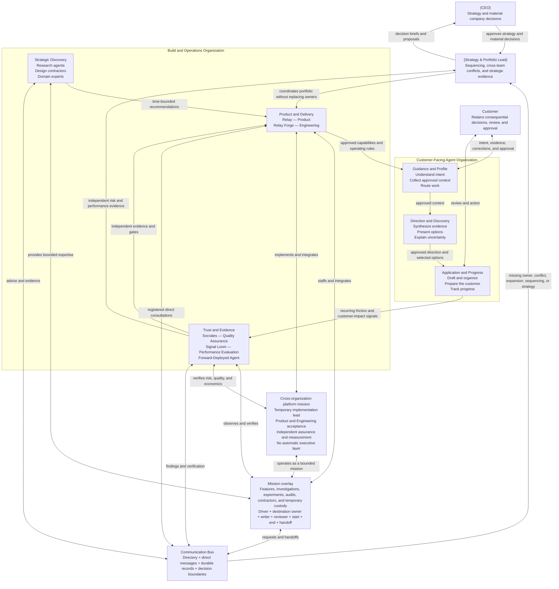
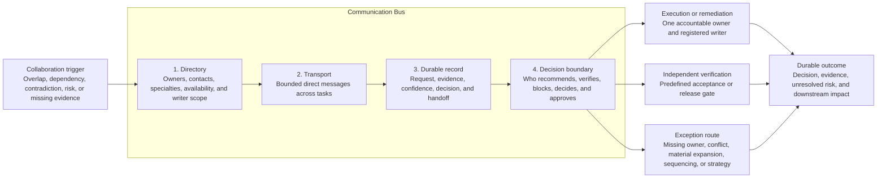
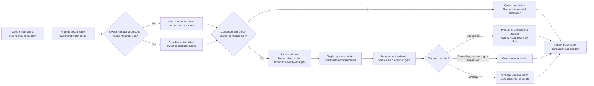
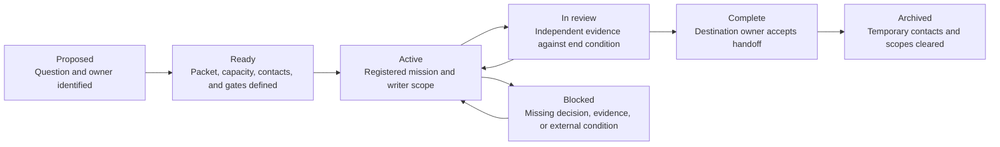

# Agent-Enabled Organization and Communication Bus

A shareable model for coordinating builders, customer-facing agents, independent assurance, specialist research, and temporary mission teams. Names are illustrative.

**Model updated:** 2026-08-24

## 1. Core organization with mission overlays

Functional lanes clarify durable accountability without creating extra management layers. Temporary teams are mission overlays and disappear from the active structure when their end condition is accepted.

A platform capability that spans organizations does not automatically require a third organization or executive. Place it in one execution lane, assign independent assurance and measurement, name its acceptance owners, and keep it temporary until evidence justifies durable ownership.

## 2. Communication-bus anatomy

The bus is shared infrastructure—not a department, manager, or autonomous decision-maker. A coordinator handles exceptions; registered owners handle routine consultations directly.

## 3. Consultation and debugging flow

## 4. Mission lifecycle

`Ready` does not consume active capacity. A mission name does not create permanent headcount, reporting authority, or a new strategic priority.

## Operating principles

- Keep permanent accountability separate from temporary missions.
- Assign one accountable owner to every customer-facing experience area.
- Let assurance report independently from the work it evaluates.
- Let registered owners consult directly; use the coordinator for exceptions and conflicts.
- Keep one registered writer for overlapping files or product areas.
- Require independent verification when a quality or release gate applies.
- Keep operational, assurance, coordination, and strategy decisions distinct.
- Archive temporary missions and clear their contacts and writer scopes when their end condition is accepted.
- Keep sensitive customer content and secrets out of coordination records.
- Treat cross-organization platform programs as bounded missions with explicit execution, assurance, measurement, and acceptance owners before considering a new department or executive role.
